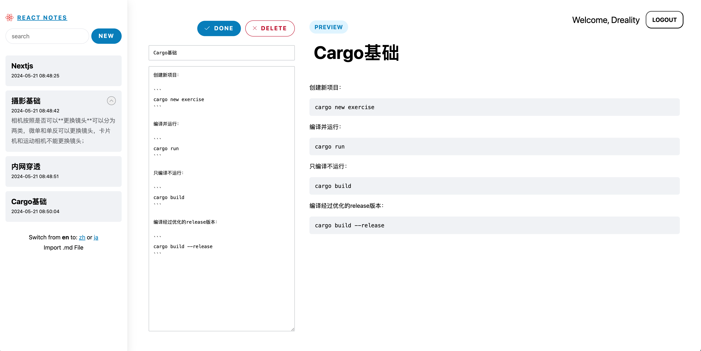

# React Notes with Next.js

This project is a Next.js implementation of a React Notes application. It adds multi-user and multilingual capabilities to the basic note-taking functionality.

## Features

- **Multi-user support:** Multiple users can create and manage their own notes.
- **Multilingual support:** Users can switch between different languages (e.g., English, Chinese, Japanese) for the UI.
- **Note management:** Create, edit, and delete notes with a user-friendly interface.
- **Markdown support:** Import note in Markdown format.

## Screenshots



## Getting Started

### Prerequisites

- Node.js (v14 or above)
- npm or yarn

### Installation

1. Clone the repository:

   ```bash
   git clone https://github.com/yourusername/react-notes-nextjs.git
   cd react-notes-nextjs
   ```

2. Install the dependencies:

   ```bash
   npm install

   # or

   yarn install
   ```

### Running the Application

1. Start the development server:

   ```bash
   npm run dev

   # or

   yarn dev
   ```

2. Open your browser and navigate to `http://localhost:3000` to see the application in action.

### Building for Production

To create an optimized production build:

```bash
npm run build
npm run start

# or

yarn build
yarn start
```

## Usage

### Creating and Managing Notes

- Click the "NEW" button to create a new note.
- Select a note from the sidebar to view or edit it.
- Use the "EDIT" button to modify an existing note.
- Delete a note by selecting it and using the appropriate option.

### Multi-user and Multilingual Capabilities

- Users can log in and manage their notes individually.
- Switch between languages using the language selector at the bottom left corner of the sidebar.

## Contributing

We welcome contributions! Please follow these steps to contribute:

1. Fork the repository.
2. Create a new branch for your feature or bugfix.
3. Commit your changes.
4. Push to your branch.
5. Open a pull request.

## License

This project is licensed under the MIT License. See the [LICENSE](LICENSE) file for details.

## Acknowledgements

- [Next.js](https://nextjs.org/)
- [React](https://reactjs.org/)
- [Markdown](https://www.markdownguide.org/)
